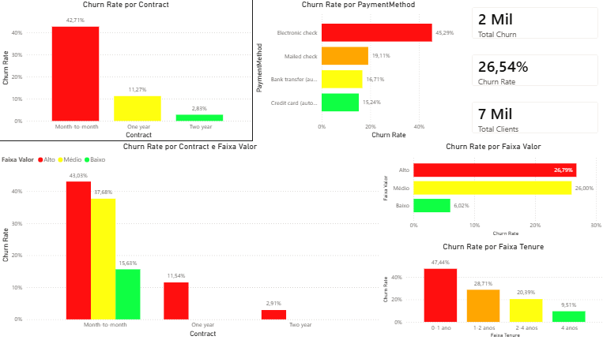
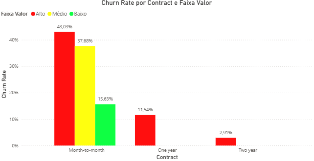

# 📊 Customer Churn Analysis

## 📌 Project Overview

This project analyzes customer churn behavior using SQL and Power BI.
The objective is to identify key factors that drive customer cancellations and generate actionable insights to improve retention strategies.

---

## 🛠️ Tools & Technologies

* SQL (MySQL)
* Power BI
* Data Analysis
* Data Visualization

---

## 📂 Project Structure

```
churn-analysis/
│
├── data/
│   └── Telco-Customer-Churn.csv
│
├── sql/
│   ├── setup.sql
│   └── analysis.sql
│
├── powerbi/
│   └── churn_dashboard.pbix
│
├── images/
│   ├── dashboard.png
│   └── churn_by_contract.png
│
└── README.md
```

---

## 📊 Dashboard



---

## 🔍 Key Insights

### 📉 Overall Churn Rate

* The overall churn rate is **26.54%**, indicating a significant customer retention challenge.

---

### 📅 Contract Type Impact



* Customers with **month-to-month contracts** have the highest churn rate (~42%).
* Long-term contracts (**1-year and 2-year**) significantly reduce churn risk.

---

### 💰 Monthly Charges

* Higher monthly charges are associated with higher churn rates.
* High-value customers represent a critical risk segment.

---

### ⏳ Customer Tenure

* Customers in their first year show the highest churn (~47%).
* Retention improves as customer tenure increases.

---

### 💳 Payment Method

* Customers using **electronic check** exhibit the highest churn (~45%).
* Automatic payment methods are linked to lower churn rates.

---

## 🎯 Business Recommendations

* Encourage migration to **long-term contracts** to improve retention
* Develop onboarding strategies for **new customers (0–12 months)**
* Promote **automatic payment methods** to reduce churn risk
* Monitor and engage **high-value customers** proactively

---

## 🚀 How to Run the Project

### 1. SQL Analysis

* Execute `setup.sql` to create the database structure
* Run `analysis.sql` to reproduce the insights

### 2. Power BI Dashboard

* Open `churn_dashboard.pbix` using Power BI Desktop
* Explore the interactive dashboard

---

## 📎 Dataset

This project uses the Telco Customer Churn dataset, a widely used dataset for churn analysis.

* Source: https://www.kaggle.com/datasets/blastchar/telco-customer-churn

---

## 👤 Author

Henrique Diego Sabará Silva

---

## ⭐ Project Purpose

This project was developed to demonstrate practical skills in:

* Writing efficient SQL queries
* Performing exploratory data analysis (EDA)
* Generating business insights
* Building interactive dashboards with Power BI
